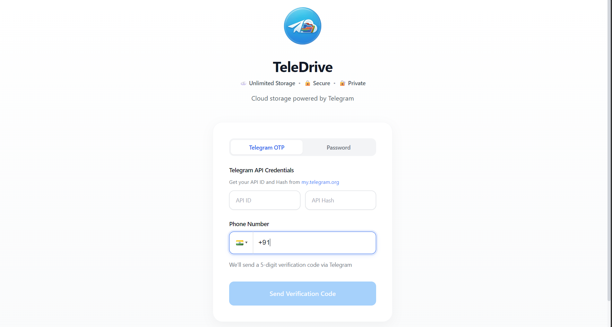
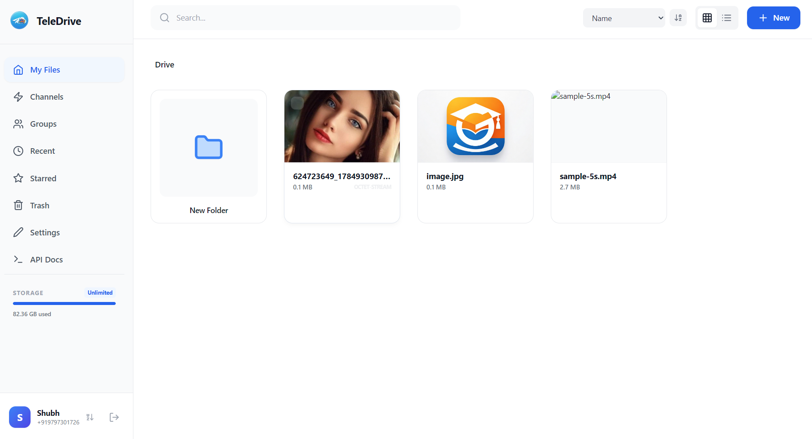
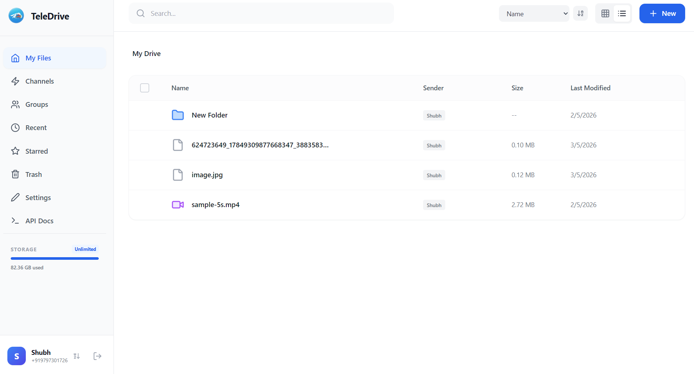
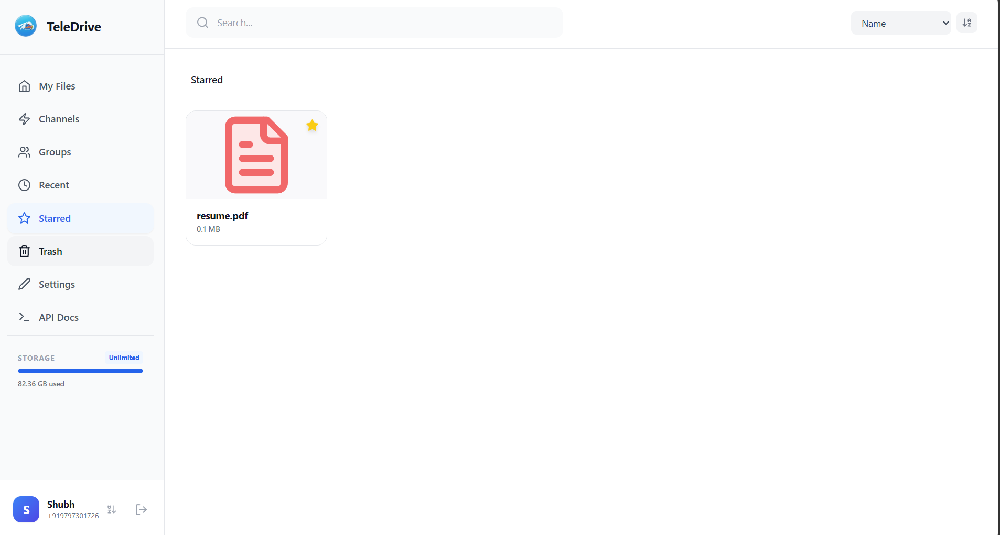
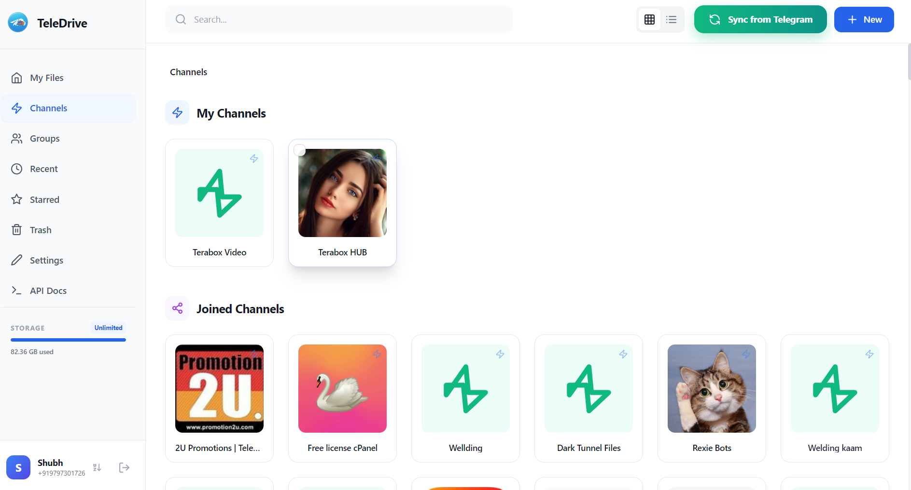
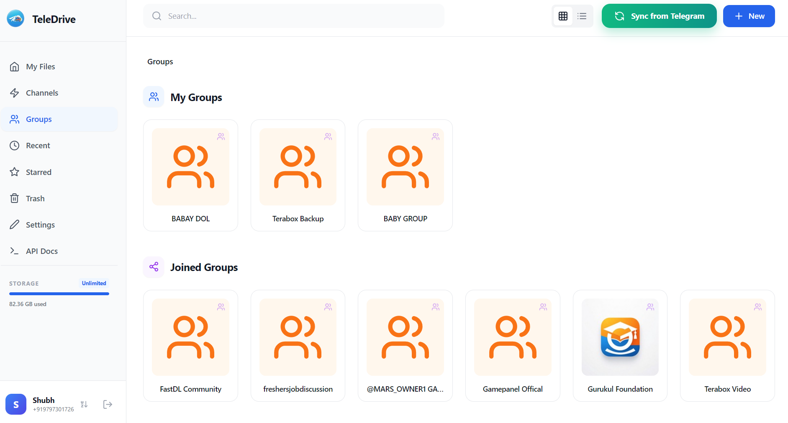
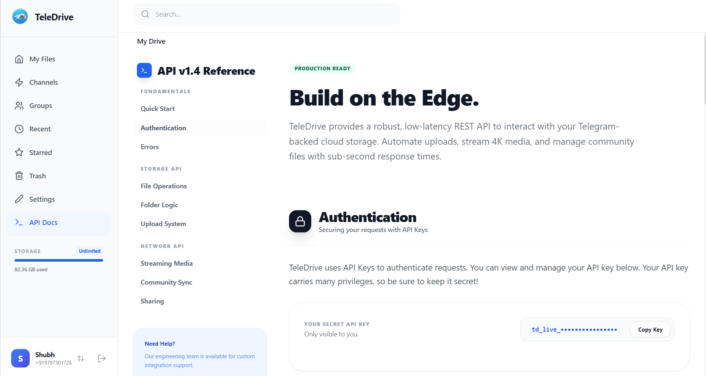
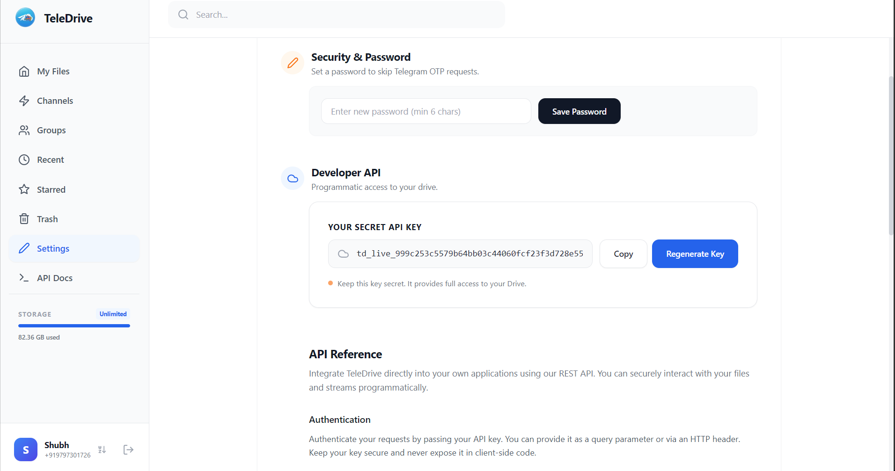

<div align="center">
  

  <h1>TeleDrive</h1>
  <p><strong>Unlimited cloud storage powered by Telegram. Stream media, manage channels & groups, share files — no storage limits, ever.</strong></p>

  <p>
    
    
    
    
    <a href="https://t.me/shubham97j"></a>
    <a href="https://www.linkedin.com/in/shubhamjha2005/"></a>
  </p>

  <p>
    <strong>🌐 Live Demo:</strong><br>
    https://teledrive-e27w.vercel.app/
  </p>
  
</div>

---

## 🚀 Live Demo

Try TeleDrive instantly:

🔗 https://teledrive-e27w.vercel.app/

**Demo Login Flow**
1. Enter Telegram API ID & API Hash
2. Enter your phone number
3. Receive OTP in Telegram
4. Start uploading and managing files

> No installation required.
> 

## 📸 Screenshots

| Login | Drive (Grid) |
|---|---|
|  |  |

| List View | Starred |
|---|---|
|  |  |

| Channels | Groups |
|---|---|
|  |  |

| API Docs | API Key Settings |
|---|---|
|  |  |

---

## 🎬 Demo Video

> Full walkthrough — login with Telegram OTP, upload files, sync channels, preview media, share folders, and more.

https://github.com/user-attachments/assets/bf59f83b-3d36-41ad-9d0a-f937db93836f

---

## ✨ Complete Feature Reference


### 🔐 Authentication & Accounts

#### Telegram OTP Login
1. Go to [my.telegram.org](https://my.telegram.org) → **API Development Tools**
2. Create an app → copy **API ID** and **API Hash**
3. On the TeleDrive login screen, enter your API ID, API Hash, and phone number (with country code e.g. `+919797301726`)
4. Click **Send Verification Code** — a 5-digit OTP arrives in your Telegram app
5. Enter the OTP → you're logged in

#### Password Login
- Switch to the **Password** tab on the login screen
- Enter your phone + the password you set inside TeleDrive Settings
- Useful for returning users who don't want to re-enter API credentials each time

#### Multi-Account Support
- Click your **profile picture / name** in the bottom-left corner
- Click **＋** to add another Telegram account
- Switch between accounts instantly — each has its own isolated Drive, Channels, and Groups
- Session is saved; no re-login needed after restart

#### Set a Password (Settings)
- Sidebar → **Settings** → **Security & Password**
- Set a password (min 6 chars) to enable fast login via the Password tab
- Protects your account if someone else has browser access

---

### 📁 File Manager

#### Upload Files
| Method | How |
|---|---|
| Button | Click **＋ New** → **Upload Files** → select files |
| Drag & Drop | Drag any file from your desktop and drop it anywhere in the file area |
| Import URL | Click **＋ New** → **Import from URL** → paste a direct link (e.g. `https://example.com/video.mp4`) |

> Files are split into **1 MB chunks** and uploaded in parallel. A progress panel appears in the bottom-right showing speed, percentage, and status for each file.

#### Create Folders
- **＋ New** → **New Folder** → type a name → Enter
- **＋ New** → **New Channel Folder** — links to a Telegram channel
- **＋ New** → **New Group Folder** — links to a Telegram group
- **＋ New** → **New Text File** — creates an empty `.txt` you can edit in-browser

#### Navigate Folders
- **Double-click** any folder to open it
- Use the **breadcrumb bar** at the top to jump back to any parent folder
- The URL updates automatically — bookmarking or sharing the URL restores your exact location

#### Grid View vs List View
- Toggle using the **⊞ / ☰** buttons in the top-right
- **Grid view** — thumbnail cards with file name and size
- **List view** — sortable table with columns: Name, Sender, Size, Last Modified
- Click column headers in list view to sort ascending / descending

#### Search
- Click the **Search bar** at the top and type — results appear instantly as you type (debounced 500ms)
- Searches across **all files and folders** by name (case-insensitive)
- Click any result to navigate directly to it

#### Sort Files
- Use the **Name ▼** dropdown → sort by Name, Size, or Date
- Click the **⇅** icon to toggle ascending / descending order

---

### 📄 File Actions

Right-click any file or click the **⋮** (three-dot) menu to access:

| Action | Description |
|---|---|
| **Open / Preview** | Double-click or click Preview to open the inline viewer |
| **Download** | Downloads the file through the browser |
| **Rename** | Inline rename input — press Enter to save |
| **Star / Unstar** | Adds to / removes from Starred collection |
| **Copy** | Copies the file reference to clipboard |
| **Cut** | Marks the file for moving |
| **Paste** | Right-click in target folder → Paste to complete move/copy |
| **Share** | Generates a public share link (see Sharing section) |
| **Info** | Shows file details: size, type, upload date, sender |
| **Set Thumbnail** | Upload a custom thumbnail image for any file |
| **Compress** | Creates a `.zip` containing the file |
| **Extract** | Extracts a `.zip` file into a new folder |
| **Move to Trash** | Soft-deletes — file goes to Trash, not permanently deleted |
| **Delete** | Only available inside Trash — permanently removes the file |

#### Drag & Drop Between Folders
- Select files using the **checkboxes** (hover to reveal)
- Drag selected files to a folder card to move them

#### Bulk Actions
- Check multiple items using checkboxes
- A **bulk action bar** appears at the top: Star, Trash all selected items at once
- **Select All** checkbox in list view header selects every item on the page

#### File Info Panel
- Right-click → **Info** (or click ℹ️ from the menu)
- Shows: full filename, MIME type, size, upload date, sender name

---

### 👁️ File Preview & Media Player

Double-click any file to open the inline previewer:

| File Type | Preview Behaviour |
|---|---|
| **Images** (jpg, png, gif, webp…) | Full-resolution inline viewer |
| **Videos** (mp4, mkv, webm, mov…) | Custom video player with seek bar, play/pause, mute, fullscreen |
| **Audio** (mp3, ogg, wav, flac…) | Audio player with native controls |
| **PDF** | Embedded PDF viewer; fallback link to open in new tab |
| **Text / Code** | Editable textarea — make changes and click **Save Changes** |
| **Other** | Shows a Download button |

> Videos support **range requests** — you can seek to any position without downloading the full file.

**Keyboard shortcuts in the viewer:**
- `Escape` — Close the viewer
- `←` / `→` (Share page lightbox) — Navigate between files

---

### ⭐ Starred Files
- Star any file or folder via right-click → **Star**
- Access from sidebar → **Starred**
- Unstar from the same menu or from the Starred view

---

### 🕐 Recent Files
- Sidebar → **Recent** shows the 50 most recently accessed files
- Ordered by last-viewed timestamp

---

### 🗑️ Trash
- **Move to Trash** — soft-deletes; item is hidden from Drive but not gone
- Sidebar → **Trash** — see all trashed items
- **Restore** — right-click → Restore → item returns to its original location
- **Delete Permanently** — right-click → Delete (only available in Trash view)
- Trashed files cannot be previewed or opened — restore first

---

### 📡 Channels & Groups

#### Connect Your Channels/Groups
- Sidebar → **Channels** or **Groups**
- Shows **My Channels** (channels you own/admin) and **Joined Channels**
- Click **Sync from Telegram** (green button, top-right) to pull all media from a channel/group into TeleDrive

#### Create a Channel Folder
- **＋ New** → **New Channel Folder** → enter the channel name/ID
- Files posted in that channel appear as files inside the folder

#### Browse Channel Files
- Double-click a channel card to enter it
- All media (photos, videos, documents) are listed just like a regular Drive folder
- Full preview, download, and share work the same way

---

### 🔗 Sharing

#### Share a File (Public Link)
1. Right-click any file → **Share** (or click ⋮ → Share)
2. TeleDrive generates a public URL: `http://yourdomain/share/<token>`
3. A modal appears with the link — click **Copy Link** or **Open Link**
4. Anyone with the link can view and download the file — **no login required**

#### Share a Folder (Public Link)
1. Right-click any folder → **Share**
2. Same flow — generates a folder share URL
3. Recipients see a **thumbnail grid** of all files in the folder
4. They can preview images/videos in a full-screen lightbox and download individual files

#### What Recipients See (Share Page)
- **Header** — TeleDrive logo + Sign in button
- **Shared by** — owner's name
- **Folder view** — responsive thumbnail grid (2–6 columns)
  - Image/Video files show real Telegram thumbnails
  - Video cards show a ▶ play button
  - Hover → Download + Preview icons appear
- **Lightbox** — click any image/video → full-screen viewer
  - `←` `→` keys to navigate, `Escape` to close
- **Single file view** — shows thumbnail + Download + Preview buttons

> Share links are **permanent** (no expiry by default). The file streams directly from Telegram via the share token — recipients never need a TeleDrive account.

---

### 📦 Compress & Extract

#### Compress a File
- Right-click any file → **Compress**
- Enter a ZIP name → click **Compress**
- A `.zip` file appears in the same folder

#### Extract a ZIP
- Right-click any `.zip` file → **Extract**
- Enter a folder name → click **Extract**
- All contents appear inside a new folder

---

### 🌐 Import from URL
- **＋ New** → **Import from URL**
- Paste any direct download URL (must start with `http://` or `https://`)
- TeleDrive downloads the file on the server and uploads it to Telegram
- Progress is tracked in the uploads panel (bottom-right)
- Useful for importing files from external servers without downloading to your device first

---

### 🛠️ Settings

| Setting | Location | Description |
|---|---|---|
| **Security Password** | Settings → Security | Set a password for fast Password-tab login |
| **Developer API Key** | Settings → Developer API | Generate a `td_live_*` key for programmatic access |
| **Regenerate API Key** | Settings → Developer API → Regenerate Key | Invalidates old key, generates new one |
| **Copy API Key** | Settings → Developer API → Copy | Copies key to clipboard |

---

### 🔑 Developer API

#### Get Your API Key
- Sidebar → **Settings** → scroll to **Developer API**
- Click **Regenerate Key** to create a `td_live_...` key
- Copy it — store it securely, it has full Drive access

#### Authenticate API Requests
```http
# Option 1: Bearer token (JWT)
Authorization: Bearer eyJhbGci...

# Option 2: API Key header
X-API-Key: td_live_999c253c5579b64bb03c44060fcf23f3d728e55
```

#### Key API Endpoints

**Files & Folders**
```http
GET    /api/folders/root              # List root contents
GET    /api/folders/:id               # List folder contents
POST   /api/folders                   # Create folder
PATCH  /api/files/:id                 # Rename / move / star / trash
DELETE /api/files/:id                 # Delete permanently
GET    /api/files/:id/preview         # Stream file (range requests supported)
GET    /api/files/:id/download        # Download with attachment header
GET    /api/files/:id/thumbnail       # Get thumbnail image
GET    /api/files/filter/starred      # List starred files
GET    /api/files/filter/recent       # List recent files
GET    /api/files/trash/all           # List trashed items
GET    /api/search?q=keyword          # Search files and folders
```

**Uploads**
```http
POST   /api/uploads/init              # Initialize chunked upload
POST   /api/uploads/:id/chunk         # Upload a chunk
POST   /api/uploads/:id/commit        # Finalize upload
GET    /api/uploads/:id/status        # Check upload status
POST   /api/uploads/import-url        # Import file from URL
```

**Sharing**
```http
POST   /api/shares                    # Create share link
GET    /api/shares/:token             # Get share metadata (public)
GET    /api/shares/:token/folder-contents   # List shared folder files
GET    /api/shares/:token/preview     # Stream shared file
GET    /api/shares/:token/download    # Download shared file
GET    /api/shares/:token/thumbnail   # Get shared file thumbnail
GET    /api/shares/:token/files/:fileId/preview    # Preview file in shared folder
GET    /api/shares/:token/files/:fileId/download   # Download file in shared folder
GET    /api/shares/:token/files/:fileId/thumbnail  # Thumbnail in shared folder
```

**Example: Share a folder**
```bash
curl -X POST http://localhost:3000/api/shares \
  -H "Authorization: Bearer YOUR_JWT" \
  -H "Content-Type: application/json" \
  -d '{ "folderId": "64abc123...", "type": "public" }'

# Response:
# { "token": "df64ae9458c64c39", "shareUrl": "http://localhost:5173/share/df64ae9458c64c39" }
```

See the full interactive reference inside the app: **Sidebar → API Docs**

---

## 🚀 Setup Guide

### Prerequisites
- Node.js v18+
- MongoDB (local or [Atlas free tier](https://cloud.mongodb.com))
- Telegram API credentials from [my.telegram.org](https://my.telegram.org)

### Step 1 — Clone
```bash
git clone https://github.com/ShUBHaMJHA9/Telegram-Drive.git
cd Telegram-Drive
```

### Step 2 — Backend config
```bash
cd backend
cp .env.example .env
```

Edit `.env`:
```env
TELEGRAM_API_ID=11468953          # from my.telegram.org
TELEGRAM_API_HASH=99f7513e...     # from my.telegram.org
MONGO_URI=mongodb://localhost:27017/telegram-drive
JWT_SECRET=change-this-to-a-random-long-string
FRONTEND_URL=http://localhost:5173
```

### Step 3 — Run backend
```bash
cd backend
npm install
npm run dev      # starts on http://localhost:3000
```

### Step 4 — Run frontend
```bash
cd frontend
npm install
npm run dev      # opens http://localhost:5173
```

### Step 5 — First login
1. Open `http://localhost:5173`
2. Enter **API ID** + **API Hash** + **Phone number** (e.g. `+919797301726`)
3. Enter the **OTP** from your Telegram app
4. Done — your Drive is ready!

---

## 🐳 Docker

```bash
# Copy env file and fill in your credentials
cp backend/.env.example backend/.env

# Start all services
docker compose up -d
```

Services:
- Backend → `http://localhost:3000`
- Frontend → `http://localhost:5173`
- MongoDB → internal container

---

## 📁 Project Structure

```
Telegram-Drive/
├── backend/
│   ├── src/
│   │   ├── routes/
│   │   │   ├── auth.js         # OTP + JWT + password auth
│   │   │   ├── files.js        # Files, folders, stream, thumbnail, sync
│   │   │   ├── uploads.js      # Chunked upload + URL import
│   │   │   └── shares.js       # Public share links (file + folder)
│   │   ├── models/index.js     # User, File, Folder, Share, UploadSession schemas
│   │   ├── middleware/auth.js  # JWT + API Key verification
│   │   └── server.js           # Express entry, CORS, rate limiting
│   └── .env.example
│
├── frontend/
│   ├── public/logo.png
│   └── src/
│       ├── App.jsx             # React Router: / and /share/:token
│       ├── api/client.js       # All API helpers (fileAPI, shareAPI, uploadAPI…)
│       ├── components/
│       │   ├── PremiumFileManager.jsx  # Full app: Drive, Channels, Groups, Settings, Docs
│       │   └── AuthScreen.jsx          # Login / OTP / Password screen
│       ├── pages/SharePage.jsx # Public share page — no login required
│       ├── store/              # Zustand state (auth, files)
│       └── hooks/              # useFileOperations, useChunkedUpload
│
├── screenshot/                 # App screenshots
├── docker-compose.yml
├── LICENSE                     # MIT
└── README.md
```

---

## ❓ Troubleshooting

| Problem | Solution |
|---|---|
| **OTP not received** | Make sure phone number includes country code (`+91...`). Check Telegram app — not SMS. |
| **"API ID/Hash invalid"** | Re-copy from [my.telegram.org](https://my.telegram.org) — no spaces, no quotes |
| **Thumbnails not loading** | File must be synced from Telegram first. Try right-clicking → **Set Thumbnail** |
| **Video won't play** | Browser must support the video codec. Try downloading and playing locally |
| **Share link says "Link Unavailable"** | The token may be wrong. Re-generate via right-click → Share |
| **Upload stuck at 0%** | Check backend is running on port 3000. Check `.env` credentials |
| **Channel not showing files** | Click **Sync from Telegram** button on the Channels page |
| **Can't move files between folders** | Right-click → **Cut** → navigate to target folder → right-click blank area → **Paste** |
| **Search returns nothing** | Search only matches file/folder **names** — not content inside files |

---

## 🏗️ Tech Stack

| Layer | Technology |
|---|---|
| Frontend | React 18, Vite, TailwindCSS, Zustand, React Router v6 |
| Backend | Node.js ESM, Express 4, GramJS (MTProto) |
| Database | MongoDB 7, Mongoose |
| Auth | JWT, Telegram OTP |
| Performance | Compression (gzip/brotli), Helmet, Rate limiting, Client cache |
| File Ops | Multer, ADM-ZIP, Chunked streaming |

---

## 📞 Contact & Support

| | |
|---|---|
| 📱 Telegram | [@shubham97j](https://t.me/shubham97j) |
| 📧 Email | [shubhamjha2208@gmail.com](mailto:shubhamjha2208@gmail.com) |
| 🐙 GitHub | [@ShUBHaMJHA9](https://github.com/ShUBHaMJHA9) |
| 💼 LinkedIn | [shubhamjha2005](https://www.linkedin.com/in/shubhamjha2005/) |

Open a [GitHub Issue](https://github.com/ShUBHaMJHA9/Telegram-Drive/issues) for bugs or feature requests.

---

## 📜 License

MIT License © 2026 [Shubham Jha](https://github.com/ShUBHaMJHA9)

> TeleDrive is an independent open-source project, not affiliated with Telegram Messenger Inc. Usage is subject to [Telegram's ToS](https://core.telegram.org/api/terms).

---

<div align="center">
  <sub>Made with ❤️ by <a href="https://t.me/shubham97j">Shubham Jha</a> · <a href="https://www.linkedin.com/in/shubhamjha2005/">LinkedIn</a> · <a href="https://github.com/ShUBHaMJHA9">GitHub</a> — give it a ⭐ if it helped you!</sub>
</div>
